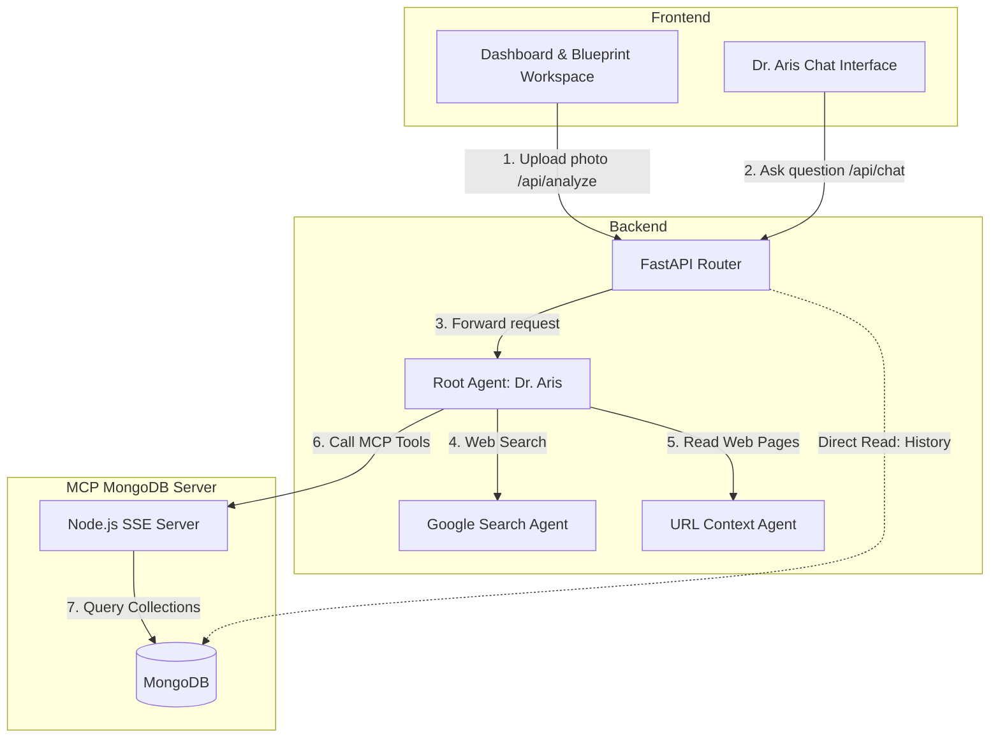

# Spatial Optician Project Architecture

**Spatial Optician** is an intelligent analytical platform designed for performing energy-efficient facility lighting audits, calculating retrofitting Return on Investment (ROI), and conducting automated fixture selection. Supported by the **MongoDB for Startups** program, the system leverages high-performance cloud databases and a custom Model Context Protocol (MCP) gateway to deliver real-time, data-driven recommendations powered by an AI Agent (Gemini 3.5 Flash) integrated via **Google ADK (Agent Development Kit)**.

The project is composed of three main components:
1. **Frontend (Client Application)**: A modern user interface styled as an interactive engineering blueprint.
2. **Backend (API Server)**: A FastAPI service that initializes and hosts the autonomous AI Agent **Dr. Aris** using Google ADK.
3. **MCP MongoDB Server (Database Access Service)**: A specialized Model Context Protocol server that grants the AI Agent secure, structured access to the MongoDB database containing equipment catalogs, audits, and tariffs.

---

## 🏗️ Architecture & Interaction Overview (Component Diagram)

The following diagram illustrates how the system components interact:



---

## 📂 Project Directory Structure

```text
spatial-optician/
├── backend/                  # FastAPI Server (Python)
│   ├── main.py               # Main API file & ADK agent initialization
│   ├── seed_db.py            # Database seeding script for MongoDB
│   ├── pyproject.toml        # Backend dependencies (FastAPI, PyMongo, Pydantic, ADK)
│   ├── Dockerfile            # Container configuration for the backend
│   └── .env                  # Environment configurations (MONGODB_URI, etc.)
│
├── frontend/                 # Client UI (React + TypeScript)
│   ├── src/
│   │   ├── App.tsx           # Primary Blueprint UI and widgets
│   │   ├── index.css         # Tailwind CSS v4 custom variables and styles
│   │   └── main.tsx          # React application entry point
│   ├── package.json          # UI dependencies (Vite, React 19, Motion, Lucide)
│   └── tsconfig.json         # TypeScript compiler configurations
│
├── mcp-mongo/                # MongoDB MCP Server (Node.js + TS)
│   ├── src/
│   │   └── index.ts          # MCP protocol implementation & DB tools
│   ├── package.json          # MCP dependencies (@modelcontextprotocol/sdk, express, mongodb)
│   ├── tsconfig.json         # TypeScript settings
│   └── Dockerfile            # Container configuration for the MCP server
│
└── ARCHITECTURE.md           # This architecture documentation file
```

---

## 🖥️ 1. Frontend (Client Interface)

The frontend is designed to resemble an interactive lighting engineer's workspace (blueprint aesthetic) using deep blueprint blues, stark white line accents, technical typography, and micro-grid designs.

### Technology Stack:
* **Build Tooling**: Vite, TypeScript
* **UI Library**: React 19
* **Styling**: Tailwind CSS v4
* **Animations**: Motion (formerly Framer Motion) for smooth UI transitions and interactive micro-animations.
* **Icons**: Lucide React (`DraftingCompass`, `Compass`, `Ruler`, `Maximize`, `Bot`, etc.)

### Core Modules (`App.tsx`):
* **Technical Specifications & Environmental Factors**: Displays calibration details of the current workspace (optical scale, diffusion coefficient, Rayleigh scattering parameters).
* **Photo Upload Area**: A drag-and-drop workspace that accepts scans or floor photos, sending them to the `/api/analyze` endpoint.
* **Luminous Flux Data & ROI Charts**: Displays real-time metrics of calculated lux deficits and projected spatial efficiency improvements.
* **Floating Agent Chat Widget**: A console-like chat interface for conversing with Dr. Aris. It sends inputs to the `/api/chat` backend endpoint.

---

## ⚙️ 2. Backend (FastAPI & Google ADK)

The backend acts as the orchestrator, binding the client UI, MongoDB database, and AI Agents together.

### Technology Stack:
* **Web Framework**: FastAPI (Python)
* **Agent Framework**: Google ADK (Agent Development Kit)
* **DB Client**: PyMongo (used for fetching analysis history and storing Express scans)
* **Data Validation**: Pydantic (using the `SpatialAnalysisResult` model)

### AI Agent Topology (Google ADK):
The system implements a hierarchical multi-agent framework led by a Root Agent:

1. **Dr. Aris (Root Agent)**:
   * **Model**: `gemini-3.5-flash`
   * **Role**: A precise, data-driven engineering assistant specializing in facility lighting audits and energy/ROI optimization.
   * **Protocol**: Structured to execute sequential tasks: scan, analyze, query catalog for matching replacements, calculate payback periods, and output professional-grade reports. It is strictly constrained from inventing specifications, prices, or models.
   
2. **Sub-Agents**:
   * `spatial_optician_google_search_agent` — Equipped with the `GoogleSearchTool` to query current standards and external lighting regulations.
   * `spatial_optician_url_context_agent` — Equipped with the `url_context` tool to retrieve full web page contents.
   
3. **MCP Tool Integration (`McpToolset`)**:
   * Connected to the external MongoDB MCP Server via Server-Sent Events (SSE) at: `https://spatial-optician-mcp-601334765015.europe-west1.run.app/sse`. This allows Dr. Aris to dynamically query the database catalog and tables.

> [!NOTE]
> **Google Cloud Agent Builder Ecosystem Compliance:**
> As confirmed by the Google Cloud hackathon management team, implementing the agent in code via **Google ADK (Agent Development Kit)** using Python's `LlmAgent` is fully compliant with the requirements of using the *Google Cloud Agent Builder* ecosystem. Prototyping via ADK enables seamless runtime bindings on Cloud Run and a highly customized React blueprint UI.

### Primary API Endpoints:
* `GET /health` — Verifies server health and database connectivity.
* `POST /api/analyze` — Simulates depth/optical analysis of uploaded floor scans, saves metadata to MongoDB, and returns calculated results.
* `GET /api/history` — Returns the last 10 audit logs from MongoDB.
* `POST /api/chat` — Exposes the streaming/polling gateway to communicate with Dr. Aris.

---

## 🗄️ 3. MCP MongoDB Server

This microservice acts as a bridge between the AI Agent and the MongoDB database. It is implemented in TypeScript following the official **Model Context Protocol (MCP)** specifications.

In production, the server is hosted on Google Cloud Run and communicates via **Server-Sent Events (SSE)**. In local development, it can also run as a standard **Stdio** command-line process.

### Tools Exposed to the AI Agent:
1. `list_collections`: Lists all collections inside the target MongoDB database.
2. `get_schema`: Samples documents inside a collection to analyze and return the schema.
3. `query_documents`: Searches documents in a collection using MongoDB filter syntax, pagination, and projection.
4. `insert_document`: Inserts a new document into a collection.
5. `aggregate`: Executes advanced MongoDB aggregation pipelines for database-level calculations.

### Database Schema (MongoDB Collections):
The `spatial_optician` (or `spatial_optician_db`) database consists of:

* **`equipment_catalog`** (Lighting Fixture Catalog):
  ```json
  {
    "model_id": "OPT-IND-LED-200",
    "brand": "LuminaPro Industrial",
    "type": "High-Bay LED",
    "luminous_flux_lumens": 28000,
    "power_watts": 200,
    "efficacy_lm_w": 140,
    "beam_angle_degrees": 90,
    "mounting_type": "Pendant/Suspended",
    "unit_cost_usd": 185.00,
    "lifespan_hours": 60000,
    "suitable_for": ["warehouse", "factory", "heavy_industry"],
    "compatible_replacements": ["MH-HB-400W"]
  }
  ```
* **`audit_history`** (Audit History Records):
  Tracks dimensions, ceiling heights, measured average lux, target lux, lux deficits, existing legacy equipment power, and recommended replacements.
* **`energy_tariffs`** (Regional Utility Tariffs):
  Stores commercial kwh rates (`kwh_rate`) and carbon emission intensities (`commercial_co2_factor_kg_kwh`) by region (e.g., `US-NY`, `US-IL`) to calculate financial ROI and carbon offset metrics.
* **`analyses`** (Quick Scan Logs):
  Saves metadata generated during user photo uploads.

---

## 🔄 Core Data Flows

### Scenario A: Conversational ROI & Fixture Auditing
1. The user inputs into the chat widget: *"Recommend a LED replacement for legacy High-Bay 400W metal halide lamps at a New York warehouse, and calculate the payback period."*
2. The frontend POSTs the request to `/api/chat`.
3. The backend forwards the text to **Dr. Aris (ADK Root Agent)**.
4. The agent determines it needs:
   * Current utility rates in the NY region.
   * LED replacement catalog items compatible with `MH-HB-400W`.
5. The agent calls the MCP tool `query_documents` on the `energy_tariffs` collection with `{"region_code": "US-NY"}`.
6. The agent calls the MCP tool `query_documents` on the `equipment_catalog` collection with `{"compatible_replacements": "MH-HB-400W"}`.
7. Upon receiving the data (tariff rate of $0.21/kWh and the `LED-HB-150W` model consuming 150W instead of 400W), the agent runs the mathematical ROI calculation:
   * Power savings: `400W - 150W = 250W` per fixture.
   * Daily/Annual financial savings based on operating hours.
   * Break-even / payback period calculation.
8. The agent constructs a well-formatted engineering report and returns it via the API to be rendered in the chat window.

### Scenario B: Architectural Scan Upload
1. The user drags a floor plan or space photograph onto the **Photo Upload Area**.
2. The frontend transmits the file via `multipart/form-data` to `/api/analyze`.
3. The FastAPI server processes the request, computes simulated optical parameters (lux deficits, diffusion, spatial efficiency), and writes the document to the `analyses` collection in MongoDB.
4. The calculation payload is returned to the React client, instantly updating the blueprint dashboards and widgets.

### Scenario C: Agentic Self-Healing & Dynamic Database Writes (Catalog Expansion)
1. **Initial DB Query:** The user requests retrofitting options for a lighting fixture model not present in the pre-seeded MongoDB `equipment_catalog` collection.
2. **Missing Spec Detection:** The agent runs a `query_documents` call on the catalog and detects an empty result payload.
3. **Live Web Search:** Instead of stalling, the agent delegates to the `spatial_optician_google_search_agent` sub-agent, issuing a query through the `GoogleSearchTool` to locate the exact technical specs of suitable energy-efficient replacements on the live web.
4. **Data Extraction:** The agent processes the web search response and parses the fixture's metadata (model ID, lumens, watts, lifespan, cost, and compatibility).
5. **Database Writeback (MCP Tool Call):** The agent invokes the MCP tool `insert_document` on the `equipment_catalog` collection, dynamically writing the new fixture document directly into the live MongoDB database.
6. **Final Computation:** With the newly acquired data stored, the agent re-runs the ROI computations and renders a completed payback analysis report to the user.
